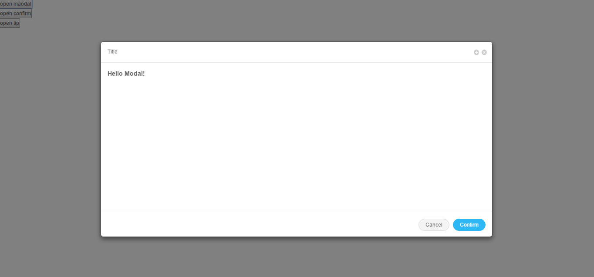
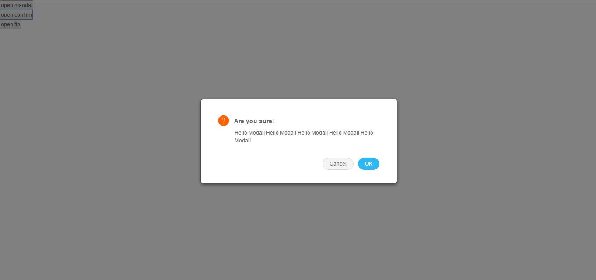
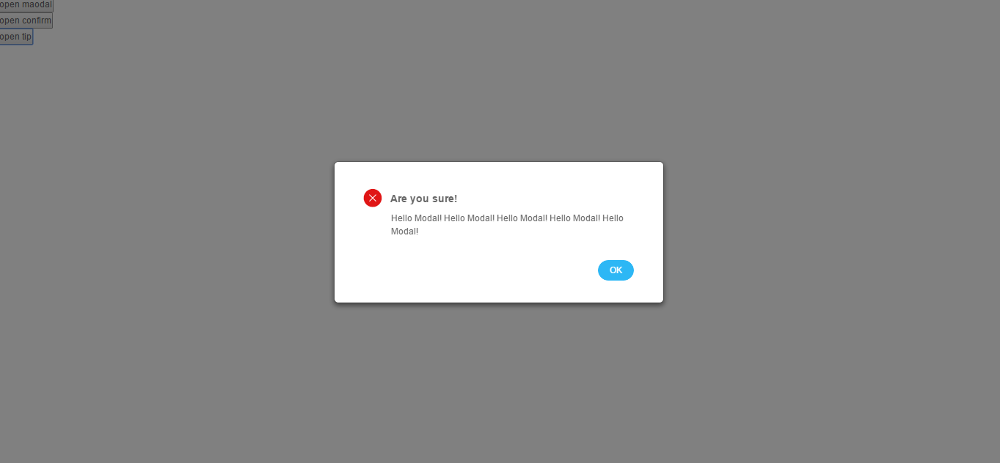


# react-antd-window
Antd window component, wrap around [react-window-kit](https://github.com/zhbhun/react-window-kit).

# Install
`npm install --save react-antd-window`

# Usage
## Modal
``` javascript
class ModalDemo extends React.Component {

    constructor(props) {
        super(props);
        this.state = {
            show: false
        }
    }

    render() {
        return (
            <div>
                <button onClick={this.openWindow.bind(this)}>open modal</button>
                <Modal
                    visible={this.state.show}
                    size='lg'
                    header='Title'
                    onHide={this.closeWindow.bind(this)}
                    onCancel={this.closeWindow.bind(this)}
                    onConfirm={this.closeWindow.bind(this)}
                    >
                    <h3>Hello Modal!</h3>
                </Modal>
            </div>
        )
    }

    openWindow() {
        this.setState({
            show: true
        })
    }

    closeWindow() {
        this.setState({
            show: false
        })
    }
}
React.render(<ModalDemo/>, document.getElementById('modal-demo'));
```


## Confirm
``` javascript
class ConfirmDemo extends React.Component {

    constructor(props) {
        super(props);
        this.state = {
            show: false
        }
    }

    render() {
        return (
            <div>
                <button onClick={this.openWindow.bind(this)}>open confirm</button>
                <Confirm
                    visible={this.state.show}
                    title='Are you sure!'
                    onCancel={this.closeWindow.bind(this)}
                    onOk={this.closeWindow.bind(this)}
                    >
                    Hello Modal! Hello Modal! Hello Modal! Hello Modal! Hello Modal!
                </Confirm>
            </div>
        )
    }

    openWindow() {
        this.setState({
            show: true
        })
    }

    closeWindow() {
        this.setState({
            show: false
        })
    }
}
React.render(<ConfirmDemo/>, document.getElementById('confirm-demo'));
```



## Tip
``` javascript
class ConfirmTip extends React.Component {

    constructor(props) {
        super(props);
        this.state = {
            show: false
        }
    }

    render() {
        return (
            <div>
                <button onClick={this.openWindow.bind(this)}>open tip</button>
                <Tip
                    visible={this.state.show}
                    type='info'
                    title='Are you sure!'
                    onOk={this.closeWindow.bind(this)}
                    >
                    Hello Modal! Hello Modal! Hello Modal! Hello Modal! Hello Modal!
                </Tip>
            </div>
        )
    }

    openWindow() {
        this.setState({
            show: true
        })
    }

    closeWindow() {
        this.setState({
            show: false
        })
    }
}
React.render(<ConfirmTip/>, document.getElementById('tip-demo'));
```



# API
## Window
| name | type | default | description |
| ------------ | ------------ | ------------ | ------------ |
| visible | Boolean | false | whether show window |
| position | Object | `{align: 'cc', offset: [0, 0]}` | Align option values: tr, tc, tl, cl, cc, cr, bl, bc, br. |
| size | Object  |   | width, height |
| closable | Boolean | true |  |
| maximizable | Boolean | false |   |
| backdrop | Boolean | true |   |
| keyboard | Boolean | true |   |
| animation | Boolean/ReactComponent |   |   |
| onAlign | function |   |   |
| onShown | function |   |   |
| onHide | function |   |   |
| onHidden | function |   |   |

## Modal
| name | type | default | description |
| ------------ | ------------ | ------------ | ------------ |
| visible | Boolean | false | whether show modal |
| size | String | md | fl: full screen, lg, md, sm |
| header | ReactElement |   |   |
| footer | ReactElement |   |   |
| onHide | function |   |   |

## Confirm
| name | type | default | description |
| ------------ | ------------ | ------------ | ------------ |
| visible | Boolean | false | whether show confirm |
| title | String |   |   |
| onCancel | function |   |   |
| onOk | function |   |   |

## Tip
| name | type | default | description |
| ------------ | ------------ | ------------ | ------------ |
| visible | Boolean | false | whether show Tip |
| type | String | info | info, success, warning, danger |
| title | String |   |   |
| onOk | function |   |   |

# License
react-antd-window is released under the MIT license.